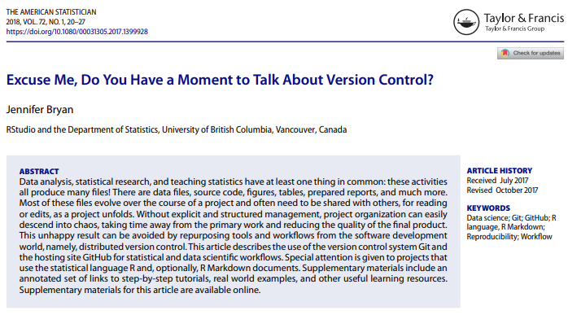
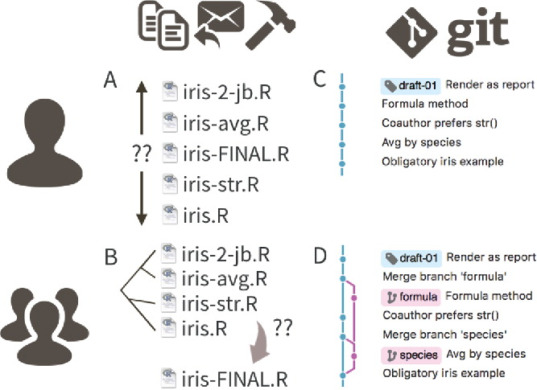

```{r setup, include=FALSE}
options(htmltools.dir.version = FALSE)
library(knitr)
```


```{r, echo=FALSE}

```

---

# Why version control

```{r, echo=FALSE}

```

---

# Why version control

.pull-left[
```{r, echo=FALSE}
include_graphics("figs/phd052810s_filenames.gif")
```
]
.pull-right[
```{r, echo=FALSE}
include_graphics("figs/phd101212s_final_doc.gif")
```
]
---

# Only as useful as you make it

```{r, echo=FALSE}
include_graphics("figs/xkcd_git_commit.png")
```

https://xkcd.com/1296/

---

# Discussion points:

.large[
- overhead vs usefulness of version control software
- version control if not using R(studio)
- version control in solo vs collaborative analyses
- what to put under version control
(code/data/results/manuscripts/none/all)?
- sensitive data vs public code repositories (e.g. Github)
]
