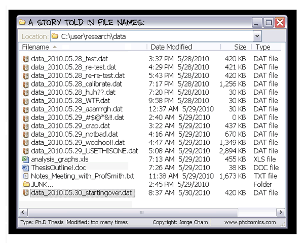

```{r setup, include=FALSE}
options(htmltools.dir.version = FALSE)
library(knitr)
```


```{r, echo=FALSE}
include_graphics("figs/title.png")
```

https://doi.org/10.1080/00031305.2017.1399928

---

# Versionshantering och git

.medium[
- "version control" - program som hjälper dig att hålla ordning på ändringar i kod och dokumentation över tid

  - *när* ändrades filen?
  - *vad* ändrades?
  - *vem* gjorde ändringen?
  - *varför?*

- enstaka filer eller stora projekt

- många system finns/fanns (RCS, CVS, SVN, Mercurial...) men **[git](https://git-scm.com/)** mest populärt

]

```{r, echo=FALSE,out.width=160}
include_graphics("figs/git_logo.png")
```


---

# Why version control

```{r, echo=FALSE}
include_graphics("figs/paper_fig1.jpeg")
```

---

# Why version control

.pull-left[
```{r, echo=FALSE}

```
]
.pull-right[
```{r, echo=FALSE}
include_graphics("figs/phd101212s_final_doc.gif")
```
]
---

# Arbeta med git

.medium[
- GUI eller kommandorad eller både och

- `git init` skapar en (dold) mapp `.git` för versionshantering

- `git add ...` anger vilka filer/ändringar som utgör en "ny version"

- `git commit -m "vad gör de här ändringarna?"` sparar ändringen med kort beskrivning
]

---

# History only as useful as you make it

```{r, echo=FALSE}
include_graphics("figs/xkcd_git_commit.png")
```

https://xkcd.com/1296/

---

# Concepts

- diff
- commit
- repository

```{r, echo=FALSE}
include_graphics("figs/paper_fig3.jpeg")
```

---
background-image: url(figs/github_mark.png)
background-size: 20%
background-position: 90% 10%

# Github

.medium[
- git är inte github - men de trivs bra ihop

- varje kopia/klon av ett git-projekt innehåller hela ändringshistoriken

- (särskilt) om flera samarbetar kan centralt repository underlätta

- github eller lokal server efter smak och tycke

]

```{r, echo=FALSE,out.width=350}
include_graphics("figs/centralized_workflow.png")
```

---

# Discussion points:

.large[
- overhead vs usefulness of version control
- solo vs collaborative projects
- what to put under version control
(code/data/results/manuscripts/none/all)?
- sensitive data vs public code repositories (e.g. Github)
- version control if not using R(studio)
- other approaches (is ManuscriptTitle_ver2_PM_LY_RK.docx good enough?)
]

---

# Tips/länkar

.large[
- [Code Refinery](https://coderefinery.org/) online git workshop 12-14 mars
- [Happy git with R](https://happygitwithr.com/) tutorial för git och github med Rstudio
- [GitHub docs](https://docs.github.com/en/get-started/start-your-journey/about-github-and-git) introduktion till git och github
]
